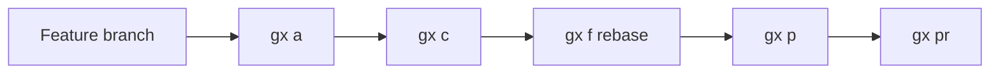
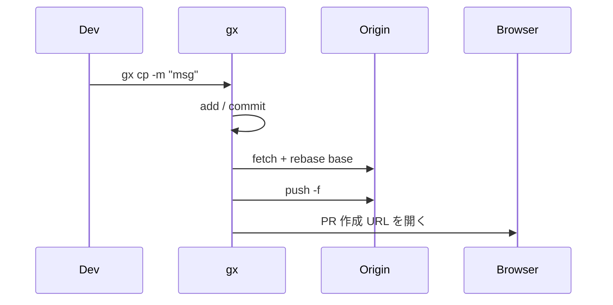
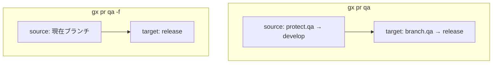
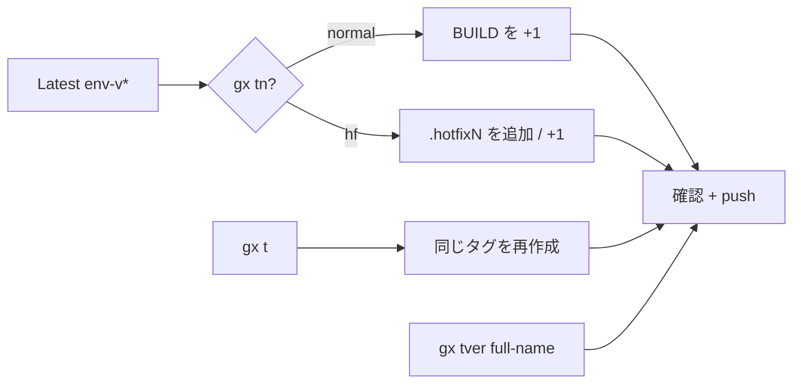

# Git Express — 詳細利用ガイド

[](USAGE.md)
[](USAGE.vi.md)
[](USAGE.ja.md)

> インストールと概要: [README.ja.md](../README.ja.md)。本ページは `gx h` / `--help` の内容を例とフロー付きで詳しく説明します。

> **Ticket-driven Git, from branch to PR.**  
> Conventional commits. Rebase before PR.  
> One CLI. Clean history.  
> Short commands. Strict conventions.

`gx`（**Git Express**）は日常の Git 向け CLI です。短いコマンド、ブランチ名から導出するコミット、PR 前の rebase、`origin` からの PR URL 推定に対応します。


## 目次

1. [考え方](#考え方)
2. [インストールとガイドを開く](#インストールとガイドを開く)
3. [日常のワークフロー](#日常のワークフロー)
4. [ブランチとコミット規約](#ブランチとコミット規約)
5. [コマンドリファレンス](#コマンドリファレンス)
6. [プルリクエスト](#プルリクエスト)
7. [設定](#設定)
8. [タグ](#タグ)
9. [トラブルシューティング](#トラブルシューティング)

---

## 考え方



一発: **`gx cp -m "message"`** = add（必要時）→ commit → rebase → force-push → PR を開く。

| 考え方 | 意味 |
|--------|------|
| ブランチが真実の源 | type + チケット ID はブランチ名に置く（DRY） |
| PR 前に rebase | `base`（通常 `develop`）上で直線的な履歴 |
| リモートから PR URL | GitHub / GitLab / Bitbucket / Azure DevOps / CodeCommit / Backlog |
| gx はフックをスキップ | `GX_SKIP_HOOKS=1` + `--no-verify` — フックは通常の git / IDE 向け |

仕様:

| 概念 | URL |
|------|-----|
| Conventional Branch | https://conventional-branch.github.io/ |
| Conventional Commits | https://www.conventionalcommits.org/ |
| Semantic Versioning | https://semver.org/ |
| GitLab Flow（プロモーション） | https://docs.gitlab.com/ee/topics/gitlab_flow.html |

---

## インストールとガイドを開く

```bash
git clone https://github.com/phamlehoan/git-express.git
cd git-express && ./install.sh          # Windows: install.ps1
gx --version
gx h
```

ドキュメントは data ディレクトリにコピーされます。いつでも開けます:

```bash
gx docs              # 英語（デフォルト）
gx docs vi           # ベトナム語
gx docs ja           # 日本語
gx docs en           # 英語
```

`gx h` はクリック可能なリンクを表示します — ローカル `file://…` とオンライン:

`https://github.com/phamlehoan/git-express/blob/main/docs/USAGE.md`

```bash
gx cfg global set docs_url 'https://github.com/phamlehoan/git-express/blob/main/docs'
```

---

## 日常のワークフロー

### 推奨ブランチ名

```text
feat/ABC-123
│    └── TICKET-ID = お使いのトラッカーのチケット／課題 ID
└── type（feat, fix, hotfix, chore, docs, refactor, test, ci, build, perf, style, revert）
```

```bash
gx co -b feat/ABC-123
```

`my-feature` のような名前は `gx co -b` で拒否されます（フック有効時も同様）。`develop`、`uat`、`qa`、`tmp` などの base / scratch は作成・チェックアウト可能です。

### 手順

```bash
gx co -b feat/ABC-123
# 編集…
gx a                              # すべて stage（cfg exclude を尊重）
gx c -m "AddLoginFilter"          # → feat: add_login_filter (abc-123)
gx f                              # base へ rebase（デフォルト: develop）
gx p                              # 現在ブランチを push
gx pr qa                          # PR 作成ページを開く（branch.qa がターゲット）
```

### ワンショット（all in one）

```bash
gx cp -m "AddLoginFilter"
# smart-add → commit → gx f → gx p -f → gx pr
```



### Amend フロー

```bash
gx c                      # amend、メッセージ維持
gx c --amend              # 同上
gx c --amend -m "NewText" # amend + 新メッセージを自動整形
gx ca                     # gx c --amend のエイリアス
gx cap                    # amend + rebase + force-push + PR
```

### 初回プロジェクト設定

```bash
gx cfg init
gx cfg set base develop
gx cfg set browser chrome
gx cfg branch qa release
gx cfg protect qa develop
gx cfg exclude add path/to/secret.json
```

---

## ブランチとコミット規約

### `gx c -m` からのコミット

| ブランチ | 入力 | 結果 |
|----------|------|------|
| `feat/ABC-123` | `AddLoginFilter` | `feat: add_login_filter (abc-123)` |
| `fix/BUG-9` | `fix login timeout` | `fix: fix login timeout (bug-9)` |
| `/` なし | `QuickPatch` | `quick_patch`（type/ticket なし） |

- `/` の前 → **type**；後 → **ticket**（メッセージ内は小文字）
- camelCase / PascalCase → `snake_case`；単語間のスペースは保持
- `gx c` は常に `--no-verify`（gx 経路はフックをスキップ）

### ブランチ規則（作成 vs コミット）

| 操作 | 許可 |
|------|------|
| `feat/ABC-123` を作成 | はい |
| `develop`、`uat`、`qa`、`staging`、`prod`、`tmp` … の作成 / checkout | はい |
| `my-feature` を作成 | いいえ（gx + hooks） |
| `develop` 上での commit（通常 git / IDE） | フック有効時は不可 — `type/TICKET-ID` 上である必要 |
| `gx c` での commit | 常に可（フックをスキップ） |

---

## コマンドリファレンス

この節は `gx h` / `--help` に沿い、詳細と例を追加しています。

### メタ

| コマンド | 内容 |
|----------|------|
| `gx h` · `-h` · `--help` | ターミナル内のフルヘルプ + docs リンク |
| `gx docs [en\|vi\|ja]` | 本ガイドを開く（ブラウザ / ローカル） |
| `gx -v` · `--version` | バージョン表示 |

```bash
gx h
gx docs
gx docs ja
gx --version
```

---

### Stage / commit / ブランチ

#### `gx a`（add）

`git add .` の後、`gx cfg exclude` のパスを unstage します。

```bash
gx cfg exclude add credentials.json
gx a          # exclude 以外をすべて stage
```

#### `gx c` / `gx ca`（commit）

| 形式 | 動作 |
|------|------|
| `gx c -m "message"` | 新規コミット、ブランチから自動整形（`--no-verify`） |
| `gx c` | 直前コミットを amend、メッセージ**維持** |
| `gx c --amend` | `gx c` と同じ |
| `gx c --amend -m "message"` | 自動整形した新メッセージで amend |
| `gx ca` | `gx c --amend` のエイリアス |

```bash
# feat/ABC-123 上
gx c -m "AddLoginFilter"
# → New commit: feat: add_login_filter (abc-123)

gx c                              # ファイル忘れ → amend で msg 維持
gx c --amend -m "AddLoginFilterV2"
```

#### `gx co`（checkout）

引数を `git checkout` に渡します。`-b` / `--branch` での作成時は名前を検証します:

```bash
gx co -b feat/ABC-123     # OK
gx co -b develop          # OK（base / scratch allowlist）
gx co -b my-feature       # Error: invalid branch name
gx co develop             # 既存ブランチへ切り替え
```

#### `gx db`（ブランチ削除）

現在ブランチと設定済み `base`（デフォルト `develop`）以外の**ローカル**ブランチを削除します。

```bash
gx db
```

---

### フック（リポジトリごとに opt-in）

Node / Husky 不要。**通常の git / VS Code·Cursor のみ**に適用。すべての `gx` コマンドは `GX_SKIP_HOOKS=1` を export します。

| コマンド | 内容 |
|----------|------|
| `gx hooks on` | `reference-transaction` + `commit-msg` + `pre-push`（+ `gx-validate.sh`）をインストール |
| `gx hooks off` | gx フックを削除（`.gx-backup` があれば復元） |
| `gx hooks status` | on/off とテンプレートパスを表示 |
| `gx hooks help` | 短いヘルプ |

| タイミング | フック | 拒否 | 許可 |
|------------|--------|------|------|
| `git branch` / `checkout -b` | `reference-transaction` | `my-feature` | `feat/ABC-123`、`develop`、`uat`、`tmp` … |
| 既存 base/scratch へ checkout | — | — | 常に |
| Commit | `commit-msg` | msg `abc` **または** ブランチ `develop` | msg OK **かつ** `feat/ABC-123` 上 |
| `git push` / タグ作成 | `pre-push` | `v1.0.0` | `core-qa-v5.3.7.0` |
| すべての `gx …` | スキップ | — | — |

```bash
gx hooks on
# VS Code Commit で "abc" → ブロック
gx c -m "AddLoginFilter"   # 動作する（フックをスキップ）
gx hooks status
gx hooks off
```

---

### Sync / push / submodule

#### `gx f`（fetch + rebase）

dirty なら stash → ターゲットのローカルコピーを削除（更新のため）→ fetch → rebase → stash 復元。

デフォルトターゲット = cfg `base`（通常 `develop`）。

```bash
gx f              # develop（または cfg base）へ rebase
gx f main         # main へ rebase
```

#### `gx p`（push）

`git push --no-verify origin <現在ブランチ>` — 追加引数はそのまま転送。

```bash
gx p
gx p -f
```

#### `gx sp` / `gx spnew`（submodule）

```bash
gx sp             # git submodule update --recursive
gx spnew          # git submodule update --init --remote --recursive
```

---

### Log / クリップボード

| コマンド | 内容 |
|----------|------|
| `gx l [git-log-args…]` | 見やすい 1 行ログ |
| `gx lg [git-log-args…]` | 同上 + graph、全ブランチ |
| `gx cc` | 最新コミットの **subject** をコピー（PR タイトル向け） |

```bash
gx l -5
gx lg --oneline -10
gx cc
```

---

### プルリクエスト / ワンショット

| コマンド | 内容 |
|----------|------|
| `gx pr [env] [-f]` | ブラウザで PR 作成ページを開く |
| `gx cpr [env]` | PR URL のみコピー（ブラウザなし） |
| `gx cp -m "msg"` | 未 stage なら `gx a`；その後 commit → `f` → `p -f` → `pr` |
| `gx cap` | 未 stage なら `gx a`；その後 amend → `f` → `p -f` → `pr` |

```bash
gx pr                     # current → base
gx pr qa                  # ターゲット = branch.qa（例: release）
gx pr qa -f               # source = 現在ブランチ（protect.* を無視）
gx cpr develop            # URL のみコピー

gx cp -m "AddLoginFilter"
gx cap                    # 直前コミット上の小さな修正後
```

ブラウザ: cfg `browser` = `default` | `chrome` | `edge` | `coccoc`。

---

### タグ

形式: `<env>-vMAJOR.MINOR.PATCH.BUILD`、任意で `.hotfixN`。  
デフォルト env: cfg `tag_env`（デフォルト `core-qa`）。

| コマンド | 内容 |
|----------|------|
| `gx t [env]` | 最新の `env-v*` を探し、確認後、ローカル+リモート削除して再作成 + push |
| `gx tn [env] [hf]` | 末尾番号を +1；`hf` で `.hotfixN` を作成/増加 |
| `gx tver <full-tag>` | 明示的なタグ名を force-create / push |

```bash
gx t core-qa
gx tn core-qa
gx tn core-qa hf
gx tver core-qa-v5.3.7.0
```

```text
core-qa-v5.3.7.0
└── env  └── MAJOR.MINOR.PATCH.BUILD

core-qa-v5.3.7.0.hotfix1
```

---

### 設定（`gx cfg`）

リポジトリごとに `~/.config/gx/projects/<hash>.conf`（`GX_CONFIG_DIR` で変更可）。

| コマンド | 内容 |
|----------|------|
| `gx cfg` | 現在リポジトリの設定を表示 |
| `gx cfg init` | 現在リポジトリのデフォルトを作成 / リセット |
| `gx cfg list` | 記憶済みプロジェクト一覧 |
| `gx cfg set <key> <value>` | プロジェクトキーを設定 |
| `gx cfg get <key>` | キー取得（project → global → default） |
| `gx cfg unset <key>` | プロジェクトキーを削除 |
| `gx cfg branch <alias> <branch>` | PR env → ターゲットブランチ |
| `gx cfg protect <alias> <branch>` | デフォルト PR **source**（`-f` でスキップ） |
| `gx cfg exclude add\|rm\|list <path>` | `gx a` 後に unstage するパス |
| `gx cfg global set\|get\|unset\|show` | グローバル既定値 |
| `gx cfg path` / `edit` | ファイルパス表示 / `$EDITOR` で開く |
| `gx cfg help` | 設定のフルヘルプ |

```bash
gx cfg init
gx cfg set base develop
gx cfg set browser chrome
gx cfg set tag_env core-qa
gx cfg set repo_name my-service
gx cfg branch qa release
gx cfg protect qa develop
gx cfg exclude add path/secret.json
gx cfg exclude list
gx cfg global set docs_url 'https://github.com/phamlehoan/git-express/blob/main/docs'
gx cfg
gx cfg help
```

| キー | 意味 |
|------|------|
| `base` | デフォルトの rebase / PR ターゲット |
| `browser` | `default` / `chrome` / `edge` / `coccoc` |
| `tag_env` | `gx t` / `gx tn` のデフォルト env |
| `repo_name` | `{repo}` / CodeCommit 名の上書き |
| `pr_template` | 任意の URL 上書き |
| `docs_url` | オンライン docs のベース（多くは global） |
| `branch.*` | env エイリアス → ターゲットブランチ |
| `protect.*` | env エイリアス → 強制 PR source |
| `exclude` | `gx a` 後に unstage（`\|` 区切り） |

---

## プルリクエスト

### `origin` からの自動 URL

| ホスト | 形 |
|--------|----|
| GitHub | `…/compare/{target}...{source}?expand=1` |
| GitLab | `…/-/merge_requests/new?…` |
| Bitbucket | `…/pull-requests/new?…` |
| Azure DevOps | `…/pullrequestcreate?…` |
| AWS CodeCommit | コンソール URL；**リージョン**は `git-codecommit.REGION.amazonaws.com` |
| Nulab Backlog | `…/pullRequests/add/{base}...{topic}` |

### env エイリアスと protect

```bash
gx cfg branch qa release     # gx pr qa → ターゲット "release"
gx cfg protect qa develop    # -f 以外は source を develop に固定
gx pr qa                     # source=develop → target=release
gx pr qa -f                  # source = 現在ブランチ
```



未対応ホスト:

```bash
gx cfg set pr_template 'https://example.com/{repo}?s={source}&t={target}'
```

プレースホルダ: `{source}` `{target}` `{source_raw}` `{target_raw}` `{repo}`。

リモートに新しいブランチの場合は、PR を開く前に少なくとも一度 push してください。

---

## 設定

上記 [設定（`gx cfg`）](#設定gx-cfg) を参照。クイックスタート:

```bash
gx cfg init
gx cfg set base develop
gx cfg set browser chrome
gx cfg help
```

---

## タグ

上記 [タグ](#タグ) を参照。フロー:



---

## トラブルシューティング

| 症状 | 対処 |
|------|------|
| `gx: command not found` | インストール先を `PATH` に追加し、端末を開き直す |
| PR URL を作れない | `git remote -v` を確認；`pr_template` または `origin` を修正 |
| PR ターゲットが違う | `gx cfg branch` / `gx cfg` |
| 現在ブランチを source にしたい | `gx pr <env> -f` |
| docs リンクがない | `./install.sh` 再実行、または `gx cfg global set docs_url '…'` |
| クリップボード失敗 | `clip` / `pbcopy` / `xclip` / `wl-copy` を入れる |
| IDE の commit が `develop` でブロック | 想定どおり — `feat/TICKET-ID` へ移るか `gx c` を使う |
| `gx co -b my-feature` が失敗 | `type/TICKET-ID` か allowlist の base 名を使う |
| フックを一度だけ回避 | `git commit --no-verify` / `git push --no-verify`（非推奨） |

---

## 関連

- [README.ja.md](../README.ja.md) — インストールとクイックスタート  
- `gx h` — ターミナル内ヘルプ  
- `gx cfg help` — 設定リファレンス  
- `gx hooks help` — フックリファレンス  
