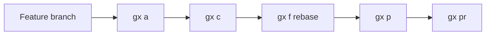
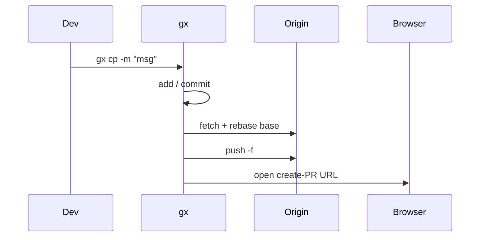
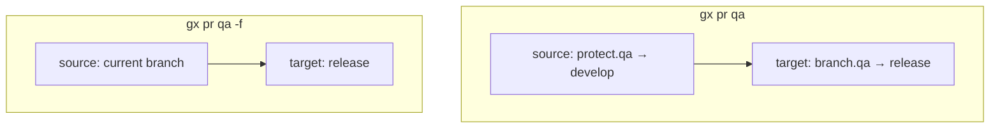
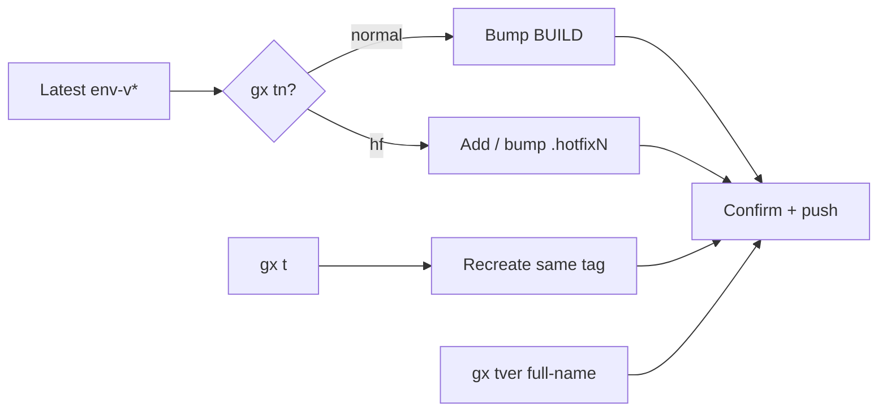

# Git Express — Detailed usage guide

[](USAGE.md)
[](USAGE.vi.md)
[](USAGE.ja.md)

> Install & overview: [README.md](../README.md). This page expands everything in `gx h` / `--help` with examples and flows.

> **Ticket-driven Git, from branch to PR.**  
> Conventional commits. Rebase before PR.  
> One CLI. Clean history.  
> Short commands. Strict conventions.

`gx` (**Git Express**) is a small CLI for everyday Git: short commands, commits derived from the branch name, rebase before opening a PR, and PR links inferred from `origin`.


## Table of contents

1. [Mental model](#mental-model)
2. [Install & open this guide](#install--open-this-guide)
3. [Daily workflows](#daily-workflows)
4. [Branch & commit conventions](#branch--commit-conventions)
5. [Command reference](#command-reference)
6. [Pull requests](#pull-requests)
7. [Configuration](#configuration)
8. [Tagging](#tagging)
9. [Troubleshooting](#troubleshooting)

---

## Mental model



Or one shot: **`gx cp -m "message"`** = add (if needed) → commit → rebase → force-push → open PR.

| Idea | Meaning |
|------|---------|
| Branch = source of truth | Type + ticket id live in the branch name (DRY) |
| Rebase before PR | Linear history onto `base` (usually `develop`) |
| PR URL from remote | GitHub, GitLab, Bitbucket, Azure DevOps, CodeCommit, Backlog |
| gx skips hooks | `GX_SKIP_HOOKS=1` + `--no-verify` — hooks only for plain git / IDE |

Specs:

| Concept | Link |
|---------|------|
| Conventional Branch | https://conventional-branch.github.io/ |
| Conventional Commits | https://www.conventionalcommits.org/ |
| Semantic Versioning | https://semver.org/ |
| GitLab Flow (promotion) | https://docs.gitlab.com/ee/topics/gitlab_flow.html |

---

## Install & open this guide

```bash
git clone https://github.com/phamlehoan/git-express.git
cd git-express && ./install.sh          # Windows: install.ps1
gx --version
gx h
```

Docs are copied into the data directory. Open anytime:

```bash
gx docs              # English (default)
gx docs vi           # Vietnamese
gx docs ja           # Japanese
gx docs en           # English
```

`gx h` prints clickable links — local `file://…` and online:

`https://github.com/phamlehoan/git-express/blob/main/docs/USAGE.md`

```bash
gx cfg global set docs_url 'https://github.com/phamlehoan/git-express/blob/main/docs'
```

---

## Daily workflows

### Recommended branch

```text
feat/ABC-123
│    └── TICKET-ID = ticket / issue ID from your tracker
└── type (feat, fix, hotfix, chore, docs, refactor, test, ci, build, perf, style, revert)
```

```bash
gx co -b feat/ABC-123
```

Invalid names like `my-feature` are rejected by `gx co -b` (and by hooks if enabled). Bases / scratch such as `develop`, `uat`, `qa`, `tmp` are allowed to create or check out.

### Step by step

```bash
gx co -b feat/ABC-123
# edit files…
gx a                              # stage all (honors cfg exclude)
gx c -m "AddLoginFilter"          # → feat: add_login_filter (abc-123)
gx f                              # rebase onto base (default: develop)
gx p                              # push current branch
gx pr qa                          # open create-PR (target from branch.qa)
```

### One-shot (all in one)

```bash
gx cp -m "AddLoginFilter"
# smart-add → commit → gx f → gx p -f → gx pr
```



### Amend flows

```bash
gx c                      # amend, keep message
gx c --amend              # same
gx c --amend -m "NewText" # amend + auto-format new message
gx ca                     # alias of gx c --amend
gx cap                    # amend + rebase + force-push + PR
```

### First-time project setup

```bash
gx cfg init
gx cfg set base develop
gx cfg set browser chrome
gx cfg branch qa release
gx cfg protect qa develop
gx cfg exclude add path/to/secret.json
```

---

## Branch & commit conventions

### Commit from `gx c -m`

| Branch | You type | Result |
|--------|----------|--------|
| `feat/ABC-123` | `AddLoginFilter` | `feat: add_login_filter (abc-123)` |
| `fix/BUG-9` | `fix login timeout` | `fix: fix login timeout (bug-9)` |
| no `/` in branch | `QuickPatch` | `quick_patch` (no type/ticket) |

- Segment before `/` → **type**; after `/` → **ticket** (lowercased in the message)
- camelCase / PascalCase → `snake_case`; spaces between words are kept
- `gx c` always uses `--no-verify` (gx path skips hooks)

### Branch rules (create vs commit)

| Action | Allowed |
|--------|---------|
| Create `feat/ABC-123` | Yes |
| Create / checkout `develop`, `uat`, `qa`, `staging`, `prod`, `tmp`, … | Yes |
| Create `my-feature` | No (gx + hooks) |
| Commit while on `develop` (plain git / IDE) | No if hooks on — must be on `type/TICKET-ID` |
| Commit via `gx c` | Always (hooks skipped) |

---

## Command reference

This section mirrors `gx h` / `--help`, with extra detail and examples.

### Meta

| Command | What it does |
|---------|----------------|
| `gx h` · `-h` · `--help` | Full in-terminal help + doc links |
| `gx docs [en\|vi\|ja]` | Open this guide (browser / local file) |
| `gx -v` · `--version` | Print version |

```bash
gx h
gx docs
gx docs vi
gx --version
```

---

### Stage / commit / branch

#### `gx a` (add)

`git add .`, then unstage paths listed in `gx cfg exclude`.

```bash
gx cfg exclude add credentials.json
gx a          # stages everything except excluded paths
```

#### `gx c` / `gx ca` (commit)

| Form | Behavior |
|------|----------|
| `gx c -m "message"` | New commit, auto-format from branch (`--no-verify`) |
| `gx c` | Amend last commit, **keep** message |
| `gx c --amend` | Same as `gx c` |
| `gx c --amend -m "message"` | Amend with new auto-formatted message |
| `gx ca` | Alias of `gx c --amend` |

```bash
# on feat/ABC-123
gx c -m "AddLoginFilter"
# → New commit: feat: add_login_filter (abc-123)

gx c                              # oops, forgot a file → amend keep msg
gx c --amend -m "AddLoginFilterV2"
```

#### `gx co` (checkout)

Passes args to `git checkout`. Creating with `-b` / `--branch` validates the name:

```bash
gx co -b feat/ABC-123     # OK
gx co -b develop          # OK (base / scratch allowlist)
gx co -b my-feature       # Error: invalid branch name
gx co develop             # switch to existing branch
```

#### `gx db` (delete branches)

Deletes **local** branches except current and configured `base` (default `develop`).

```bash
gx db
```

---

### Hooks (opt-in per repo)

No Node / Husky. Applies to **plain git / VS Code·Cursor only**. Every `gx` command exports `GX_SKIP_HOOKS=1`.

| Command | What it does |
|---------|----------------|
| `gx hooks on` | Install `reference-transaction` + `commit-msg` + `pre-push` (+ `gx-validate.sh`) |
| `gx hooks off` | Remove gx hooks (restore `.gx-backup` if any) |
| `gx hooks status` | Show on/off + template path |
| `gx hooks help` | Short help |

| When | Hook | Reject | Accept |
|------|------|--------|--------|
| `git branch` / `checkout -b` | `reference-transaction` | `my-feature` | `feat/ABC-123`, `develop`, `uat`, `tmp`, … |
| Checkout existing base/scratch | — | — | always |
| Commit | `commit-msg` | empty msg **or** branch `develop` | short msg auto-formatted on `feat/ABC-123` |
| `git push` / create tag | `pre-push` | `v1.0.0` | `core-qa-v5.3.7.0` |
| Any `gx …` | skipped | — | — |

```bash
gx hooks on
# VS Code Commit with message "abc" → blocked
gx c -m "AddLoginFilter"   # still works (skips hooks)
gx hooks status
gx hooks off
```

---

### Sync / push / submodules

#### `gx f` (fetch + rebase)

Stash if dirty → delete local copy of target (to refresh) → fetch → rebase onto target → restore stash.

Default target = cfg `base` (usually `develop`).

```bash
gx f              # rebase onto develop (or cfg base)
gx f main         # rebase onto main
```

#### `gx p` (push)

`git push --no-verify origin <current-branch>` — extra args forwarded.

```bash
gx p
gx p -f           # force-with-lease / -f as you pass
```

#### `gx sp` / `gx spnew` (submodules)

```bash
gx sp             # git submodule update --recursive
gx spnew          # git submodule update --init --remote --recursive
```

---

### Log / clipboard

| Command | What it does |
|---------|----------------|
| `gx l [git-log-args…]` | Pretty one-line log |
| `gx lg [git-log-args…]` | Same with graph, all branches |
| `gx cc` | Copy latest commit **subject** to clipboard (handy for PR title) |

```bash
gx l -5
gx lg --oneline -10
gx cc
```

---

### Pull request / one-shot

| Command | What it does |
|---------|----------------|
| `gx pr [env] [-f]` | Open create-PR page in browser |
| `gx cpr [env]` | Copy PR URL only (no browser) |
| `gx cp -m "msg"` | If nothing staged → `gx a`; then commit → `f` → `p -f` → `pr` |
| `gx cap` | If nothing staged → `gx a`; then amend → `f` → `p -f` → `pr` |

```bash
gx pr                     # current → base
gx pr qa                  # target = branch.qa (e.g. release)
gx pr qa -f               # source = current (ignore protect.*)
gx cpr develop            # copy URL only

gx cp -m "AddLoginFilter"
gx cap                    # after a small fix on top of last commit
```

Browser: cfg `browser` = `default` | `chrome` | `edge` | `coccoc`.

---

### Tags

Pattern: `<env>-vMAJOR.MINOR.PATCH.BUILD` optional `.hotfixN`.  
Default env: cfg `tag_env` (default `core-qa`).

| Command | What it does |
|---------|----------------|
| `gx t [env]` | Find latest `env-v*`, confirm, delete local+remote, recreate + push |
| `gx tn [env] [hf]` | Bump last number; with `hf` create/bump `.hotfixN` |
| `gx tver <full-tag>` | Force-create / push explicit tag name |

```bash
gx t core-qa
gx tn core-qa
gx tn core-qa hf
gx tver core-qa-v5.3.7.0
```

```text
core-qa-v5.3.7.0
└── env  └── MAJOR.MINOR.PATCH.BUILD

core-qa-v5.3.7.0.hotfix1
```

---

### Config (`gx cfg`)

Stored per repo under `~/.config/gx/projects/<hash>.conf` (`GX_CONFIG_DIR` to override).

| Command | What it does |
|---------|----------------|
| `gx cfg` | Show this repo’s config |
| `gx cfg init` | Create / reset defaults for current repo |
| `gx cfg list` | List remembered projects |
| `gx cfg set <key> <value>` | Set project key |
| `gx cfg get <key>` | Get key (project → global → default) |
| `gx cfg unset <key>` | Remove project key |
| `gx cfg branch <alias> <branch>` | Map PR env → target branch |
| `gx cfg protect <alias> <branch>` | Default PR **source** (skip with `-f`) |
| `gx cfg exclude add\|rm\|list <path>` | Paths unstaged after `gx a` |
| `gx cfg global set\|get\|unset\|show` | Global defaults |
| `gx cfg path` / `edit` | Show file path / open in `$EDITOR` |
| `gx cfg help` | Full config help |

```bash
gx cfg init
gx cfg set base develop
gx cfg set browser chrome
gx cfg set tag_env core-qa
gx cfg set repo_name my-service
gx cfg branch qa release
gx cfg protect qa develop
gx cfg exclude add path/secret.json
gx cfg exclude list
gx cfg global set docs_url 'https://github.com/phamlehoan/git-express/blob/main/docs'
gx cfg
gx cfg help
```

| Key | Meaning |
|-----|---------|
| `base` | Default rebase / PR target |
| `browser` | `default` / `chrome` / `edge` / `coccoc` |
| `tag_env` | Default env for `gx t` / `gx tn` |
| `repo_name` | Override `{repo}` / CodeCommit name |
| `pr_template` | Optional URL override |
| `docs_url` | Online docs base (often set globally) |
| `branch.*` | Env alias → target branch |
| `protect.*` | Env alias → forced PR source |
| `exclude` | Paths unstaged after `gx a` (`\|`-separated) |

---

## Pull requests

### Auto URL from `origin`

| Host | Shape |
|------|--------|
| GitHub | `…/compare/{target}...{source}?expand=1` |
| GitLab | `…/-/merge_requests/new?…` |
| Bitbucket | `…/pull-requests/new?…` |
| Azure DevOps | `…/pullrequestcreate?…` |
| AWS CodeCommit | Console URL; **region** from `git-codecommit.REGION.amazonaws.com` |
| Nulab Backlog | `…/pullRequests/add/{base}...{topic}` |

### Env alias & protect

```bash
gx cfg branch qa release     # gx pr qa → target "release"
gx cfg protect qa develop    # source forced to develop unless -f
gx pr qa                     # source=develop → target=release
gx pr qa -f                  # source=current branch
```



Unsupported host:

```bash
gx cfg set pr_template 'https://example.com/{repo}?s={source}&t={target}'
```

Placeholders: `{source}` `{target}` `{source_raw}` `{target_raw}` `{repo}`.

Push the branch at least once before opening a PR if it is new on the remote.

---

## Configuration

See [Config (`gx cfg`)](#config-gx-cfg) above. Quick start:

```bash
gx cfg init
gx cfg set base develop
gx cfg set browser chrome
gx cfg help
```

---

## Tagging

See [Tags](#tags) above. Flow:



---

## Troubleshooting

| Problem | Fix |
|---------|-----|
| `gx: command not found` | Add install dir to `PATH`, open a new terminal |
| Cannot build PR URL | Check `git remote -v`; set `pr_template` or fix `origin` |
| Wrong PR target | `gx cfg branch` / `gx cfg` |
| Want current branch as PR source | `gx pr <env> -f` |
| Docs link missing | Re-run `./install.sh`, or `gx cfg global set docs_url '…'` |
| Clipboard fails | Install `clip` / `pbcopy` / `xclip` / `wl-copy` |
| Hooks block IDE commit on `develop` | Expected — switch to `feat/TICKET-ID`, or use `gx c` |
| `gx co -b my-feature` fails | Use `type/TICKET-ID` or an allowlisted base name |
| Want to bypass hooks once | `git commit --no-verify` / `git push --no-verify` (not recommended) |

---

## See also

- [README.md](../README.md) — install & quick start  
- `gx h` — in-terminal help  
- `gx cfg help` — config reference  
- `gx hooks help` — hooks reference  
