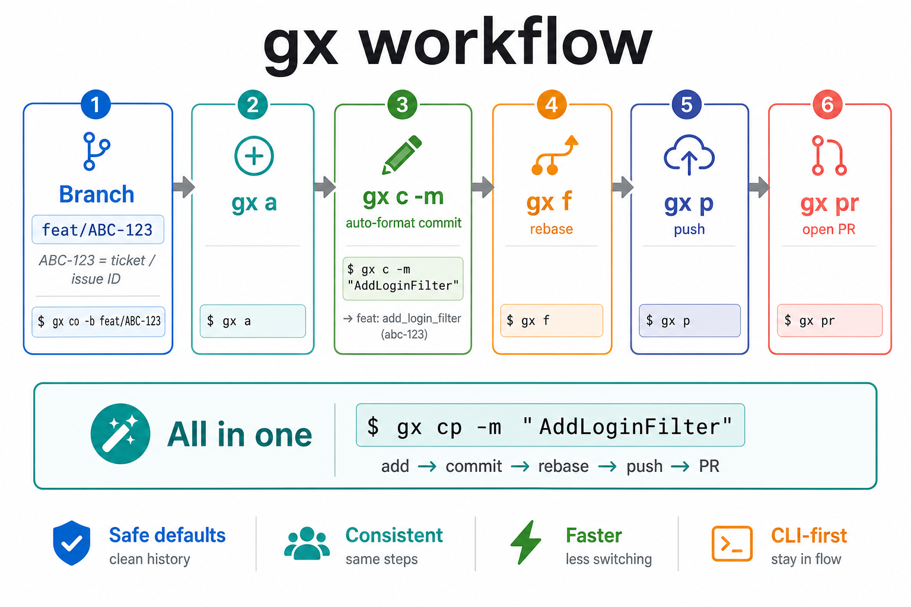
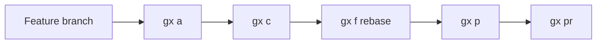
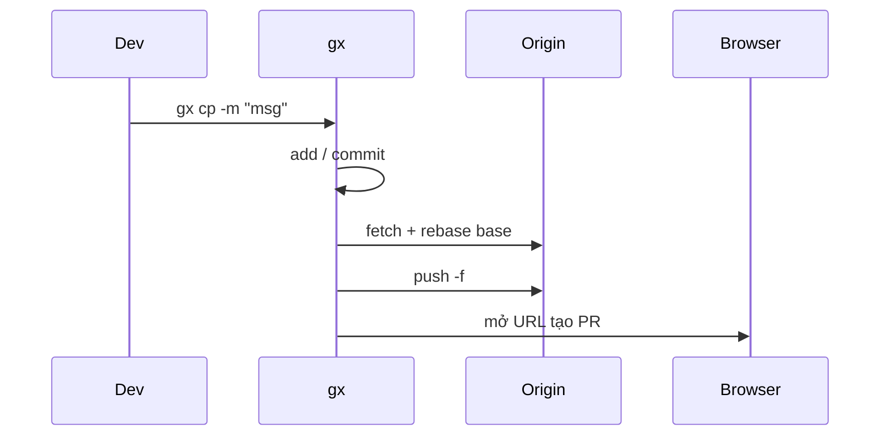
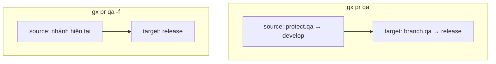
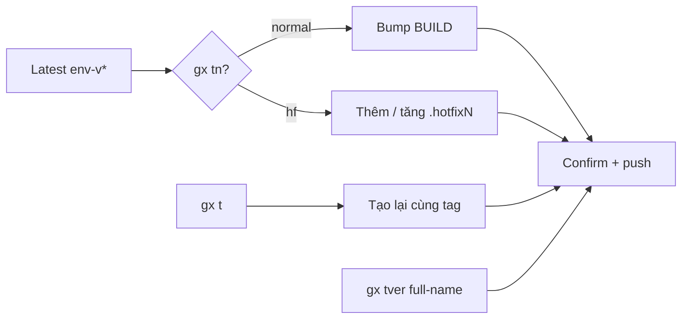

# Git Express — Hướng dẫn sử dụng chi tiết

[](USAGE.md)
[](USAGE.vi.md)
[](USAGE.ja.md)

> Cài đặt & tổng quan: [README.vi.md](../README.vi.md). Trang này mở rộng toàn bộ nội dung `gx h` / `--help` kèm ví dụ và flow.

> **Ticket-driven Git, from branch to PR.**  
> Conventional commits. Rebase before PR.  
> One CLI. Clean history.  
> Short commands. Strict conventions.

`gx` (**Git Express**) là CLI Git gọn cho công việc hàng ngày: lệnh ngắn, commit suy từ tên nhánh, rebase trước khi mở PR, và link PR suy từ `origin`.



## Mục lục

1. [Mô hình tư duy](#mô-hình-tư-duy)
2. [Cài đặt & mở guide](#cài-đặt--mở-guide)
3. [Workflow hàng ngày](#workflow-hàng-ngày)
4. [Quy ước nhánh & commit](#quy-ước-nhánh--commit)
5. [Tham chiếu lệnh](#tham-chiếu-lệnh)
6. [Pull request](#pull-request)
7. [Cấu hình](#cấu-hình)
8. [Tag](#tag)
9. [Xử lý sự cố](#xử-lý-sự-cố)

---

## Mô hình tư duy



Một phát: **`gx cp -m "message"`** = add (nếu cần) → commit → rebase → force-push → mở PR.

| Ý tưởng | Ý nghĩa |
|---------|---------|
| Nhánh = nguồn sự thật | Type + ticket nằm trong tên nhánh (DRY) |
| Rebase trước PR | Lịch sử thẳng lên `base` (thường là `develop`) |
| URL PR từ remote | GitHub, GitLab, Bitbucket, Azure DevOps, CodeCommit, Backlog |
| gx bỏ qua hook | `GX_SKIP_HOOKS=1` + `--no-verify` — hook chỉ cho git thường / IDE |

Đặc tả:

| Khái niệm | Link |
|-----------|------|
| Conventional Branch | https://conventional-branch.github.io/ |
| Conventional Commits | https://www.conventionalcommits.org/ |
| Semantic Versioning | https://semver.org/ |
| GitLab Flow (promotion) | https://docs.gitlab.com/ee/topics/gitlab_flow.html |

---

## Cài đặt & mở guide

```bash
git clone https://github.com/phamlehoan/git-express.git
cd git-express && ./install.sh          # Windows: install.ps1
gx --version
gx h
```

Docs được copy vào data directory. Mở bất cứ lúc nào:

```bash
gx docs              # English (mặc định)
gx docs vi           # Tiếng Việt
gx docs ja           # Tiếng Nhật
gx docs en           # English
```

`gx h` in link bấm được — local `file://…` và online:

`https://github.com/phamlehoan/git-express/blob/main/docs/USAGE.md`

```bash
gx cfg global set docs_url 'https://github.com/phamlehoan/git-express/blob/main/docs'
```

---

## Workflow hàng ngày

### Nhánh khuyến nghị

```text
feat/ABC-123
│    └── TICKET-ID = mã ticket / issue từ hệ thống tracker của bạn
└── type (feat, fix, hotfix, chore, docs, refactor, test, ci, build, perf, style, revert)
```

```bash
gx co -b feat/ABC-123
```

Tên kiểu `my-feature` bị từ chối bởi `gx co -b` (và bởi hook nếu đã bật). Nhánh base / scratch như `develop`, `uat`, `qa`, `tmp` được phép tạo hoặc checkout.

### Từng bước

```bash
gx co -b feat/ABC-123
# sửa code…
gx a                              # stage all (tôn trọng cfg exclude)
gx c -m "AddLoginFilter"          # → feat: add_login_filter (abc-123)
gx f                              # rebase lên base (mặc định: develop)
gx p                              # push nhánh hiện tại
gx pr qa                          # mở trang tạo PR (đích từ branch.qa)
```

### One-shot (all in one)

```bash
gx cp -m "AddLoginFilter"
# smart-add → commit → gx f → gx p -f → gx pr
```



### Luồng amend

```bash
gx c                      # amend, giữ message
gx c --amend              # giống trên
gx c --amend -m "NewText" # amend + auto-format message mới
gx ca                     # alias của gx c --amend
gx cap                    # amend + rebase + force-push + PR
```

### Setup project lần đầu

```bash
gx cfg init
gx cfg set base develop
gx cfg set browser chrome
gx cfg branch qa release
gx cfg protect qa develop
gx cfg exclude add path/to/secret.json
```

---

## Quy ước nhánh & commit

### Commit từ `gx c -m`

| Nhánh | Bạn gõ | Kết quả |
|-------|--------|---------|
| `feat/ABC-123` | `AddLoginFilter` | `feat: add_login_filter (abc-123)` |
| `fix/BUG-9` | `fix login timeout` | `fix: fix login timeout (bug-9)` |
| không có `/` | `QuickPatch` | `quick_patch` (không type/ticket) |

- Đoạn trước `/` → **type**; sau `/` → **ticket** (viết thường trong message)
- camelCase / PascalCase → `snake_case`; giữ khoảng trắng giữa từ
- `gx c` luôn dùng `--no-verify` (đường gx bỏ qua hook)

### Quy tắc nhánh (tạo vs commit)

| Hành động | Cho phép |
|-----------|----------|
| Tạo `feat/ABC-123` | Có |
| Tạo / checkout `develop`, `uat`, `qa`, `staging`, `prod`, `tmp`, … | Có |
| Tạo `my-feature` | Không (gx + hooks) |
| Commit khi đang trên `develop` (git thường / IDE) | Không nếu đã bật hook — phải trên `type/TICKET-ID` |
| Commit qua `gx c` | Luôn (bỏ qua hook) |

---

## Tham chiếu lệnh

Phần này bám `gx h` / `--help`, bổ sung chi tiết và ví dụ.

### Meta

| Lệnh | Việc làm |
|------|----------|
| `gx h` · `-h` · `--help` | Help đầy đủ trong terminal + link docs |
| `gx docs [en\|vi\|ja]` | Mở guide này (browser / file local) |
| `gx -v` · `--version` | In version |

```bash
gx h
gx docs
gx docs vi
gx --version
```

---

### Stage / commit / nhánh

#### `gx a` (add)

`git add .`, rồi unstage các path trong `gx cfg exclude`.

```bash
gx cfg exclude add credentials.json
gx a          # stage mọi thứ trừ path đã exclude
```

#### `gx c` / `gx ca` (commit)

| Dạng | Hành vi |
|------|---------|
| `gx c -m "message"` | Commit mới, auto-format từ nhánh (`--no-verify`) |
| `gx c` | Amend commit cuối, **giữ** message |
| `gx c --amend` | Giống `gx c` |
| `gx c --amend -m "message"` | Amend với message mới đã auto-format |
| `gx ca` | Alias của `gx c --amend` |

```bash
# trên feat/ABC-123
gx c -m "AddLoginFilter"
# → New commit: feat: add_login_filter (abc-123)

gx c                              # quên file → amend giữ msg
gx c --amend -m "AddLoginFilterV2"
```

#### `gx co` (checkout)

Truyền args sang `git checkout`. Tạo bằng `-b` / `--branch` sẽ validate tên:

```bash
gx co -b feat/ABC-123     # OK
gx co -b develop          # OK (allowlist base / scratch)
gx co -b my-feature       # Error: invalid branch name
gx co develop             # chuyển sang nhánh đã có
```

#### `gx db` (xóa nhánh)

Xóa nhánh **local** trừ nhánh hiện tại và `base` đã cấu hình (mặc định `develop`).

```bash
gx db
```

---

### Hooks (opt-in từng repo)

Không cần Node / Husky. Chỉ áp dụng cho **git thường / VS Code·Cursor**. Mọi lệnh `gx` export `GX_SKIP_HOOKS=1`.

| Lệnh | Việc làm |
|------|----------|
| `gx hooks on` | Cài `reference-transaction` + `commit-msg` + `pre-push` (+ `gx-validate.sh`) |
| `gx hooks off` | Gỡ hook gx (khôi phục `.gx-backup` nếu có) |
| `gx hooks status` | Hiện on/off + đường dẫn template |
| `gx hooks help` | Help ngắn |

| Thời điểm | Hook | Từ chối | Chấp nhận |
|-----------|------|---------|-----------|
| `git branch` / `checkout -b` | `reference-transaction` | `my-feature` | `feat/ABC-123`, `develop`, `uat`, `tmp`, … |
| Checkout base/scratch sẵn có | — | — | luôn |
| Commit | `commit-msg` | msg `abc` **hoặc** nhánh `develop` | msg OK **và** trên `feat/ABC-123` |
| `git push` / tạo tag | `pre-push` | `v1.0.0` | `core-qa-v5.3.7.0` |
| Mọi lệnh `gx …` | bỏ qua | — | — |

```bash
gx hooks on
# VS Code Commit với message "abc" → bị chặn
gx c -m "AddLoginFilter"   # vẫn chạy (bỏ qua hook)
gx hooks status
gx hooks off
```

---

### Sync / push / submodule

#### `gx f` (fetch + rebase)

Stash nếu dirty → xóa bản local của target (để refresh) → fetch → rebase lên target → restore stash.

Target mặc định = cfg `base` (thường `develop`).

```bash
gx f              # rebase lên develop (hoặc cfg base)
gx f main         # rebase lên main
```

#### `gx p` (push)

`git push --no-verify origin <nhánh-hiện-tại>` — args thêm được forward.

```bash
gx p
gx p -f
```

#### `gx sp` / `gx spnew` (submodule)

```bash
gx sp             # git submodule update --recursive
gx spnew          # git submodule update --init --remote --recursive
```

---

### Log / clipboard

| Lệnh | Việc làm |
|------|----------|
| `gx l [git-log-args…]` | Log một dòng đẹp |
| `gx lg [git-log-args…]` | Giống trên kèm graph, mọi nhánh |
| `gx cc` | Copy **subject** commit mới nhất (tiện làm title PR) |

```bash
gx l -5
gx lg --oneline -10
gx cc
```

---

### Pull request / one-shot

| Lệnh | Việc làm |
|------|----------|
| `gx pr [env] [-f]` | Mở trang tạo PR trên browser |
| `gx cpr [env]` | Chỉ copy URL PR (không mở browser) |
| `gx cp -m "msg"` | Nếu chưa stage → `gx a`; rồi commit → `f` → `p -f` → `pr` |
| `gx cap` | Nếu chưa stage → `gx a`; rồi amend → `f` → `p -f` → `pr` |

```bash
gx pr                     # current → base
gx pr qa                  # đích = branch.qa (vd. release)
gx pr qa -f               # source = nhánh hiện tại (bỏ protect.*)
gx cpr develop            # chỉ copy URL

gx cp -m "AddLoginFilter"
gx cap                    # sau khi sửa nhỏ trên commit cuối
```

Trình duyệt: cfg `browser` = `default` | `chrome` | `edge` | `coccoc`.

---

### Tags

Mẫu: `<env>-vMAJOR.MINOR.PATCH.BUILD` tùy chọn `.hotfixN`.  
Env mặc định: cfg `tag_env` (mặc định `core-qa`).

| Lệnh | Việc làm |
|------|----------|
| `gx t [env]` | Tìm tag `env-v*` mới nhất, confirm, xóa local+remote, tạo lại + push |
| `gx tn [env] [hf]` | Tăng số cuối; với `hf` tạo/tăng `.hotfixN` |
| `gx tver <full-tag>` | Force-create / push tên tag tường minh |

```bash
gx t core-qa
gx tn core-qa
gx tn core-qa hf
gx tver core-qa-v5.3.7.0
```

```text
core-qa-v5.3.7.0
└── env  └── MAJOR.MINOR.PATCH.BUILD

core-qa-v5.3.7.0.hotfix1
```

---

### Config (`gx cfg`)

Lưu theo repo tại `~/.config/gx/projects/<hash>.conf` (`GX_CONFIG_DIR` để đổi).

| Lệnh | Việc làm |
|------|----------|
| `gx cfg` | Hiện config repo hiện tại |
| `gx cfg init` | Tạo / reset mặc định cho repo |
| `gx cfg list` | Liệt kê project đã nhớ |
| `gx cfg set <key> <value>` | Gán key project |
| `gx cfg get <key>` | Lấy key (project → global → default) |
| `gx cfg unset <key>` | Xóa key project |
| `gx cfg branch <alias> <branch>` | Map env PR → nhánh đích |
| `gx cfg protect <alias> <branch>` | Nguồn PR mặc định (bỏ bằng `-f`) |
| `gx cfg exclude add\|rm\|list <path>` | Path unstage sau `gx a` |
| `gx cfg global set\|get\|unset\|show` | Mặc định global |
| `gx cfg path` / `edit` | Đường dẫn file / mở bằng `$EDITOR` |
| `gx cfg help` | Help config đầy đủ |

```bash
gx cfg init
gx cfg set base develop
gx cfg set browser chrome
gx cfg set tag_env core-qa
gx cfg set repo_name my-service
gx cfg branch qa release
gx cfg protect qa develop
gx cfg exclude add path/secret.json
gx cfg exclude list
gx cfg global set docs_url 'https://github.com/phamlehoan/git-express/blob/main/docs'
gx cfg
gx cfg help
```

| Key | Ý nghĩa |
|-----|---------|
| `base` | Đích rebase / PR mặc định |
| `browser` | `default` / `chrome` / `edge` / `coccoc` |
| `tag_env` | Env mặc định cho `gx t` / `gx tn` |
| `repo_name` | Override `{repo}` / tên CodeCommit |
| `pr_template` | Override URL tùy chọn |
| `docs_url` | Base docs online (thường set global) |
| `branch.*` | Alias env → nhánh đích |
| `protect.*` | Alias env → nguồn PR ép buộc |
| `exclude` | Path unstage sau `gx a` (phân tách `\|`) |

---

## Pull request

### URL tự động từ `origin`

| Host | Dạng |
|------|------|
| GitHub | `…/compare/{target}...{source}?expand=1` |
| GitLab | `…/merge_requests/new?…` |
| Bitbucket | `…/pull-requests/new?…` |
| Azure DevOps | `…/pullrequestcreate?…` |
| AWS CodeCommit | URL console; **region** từ `git-codecommit.REGION.amazonaws.com` |
| Nulab Backlog | `…/pullRequests/add/{base}...{topic}` |

### Alias env & protect

```bash
gx cfg branch qa release     # gx pr qa → đích "release"
gx cfg protect qa develop    # source ép về develop trừ khi -f
gx pr qa                     # source=develop → target=release
gx pr qa -f                  # source = nhánh hiện tại
```



Host không hỗ trợ:

```bash
gx cfg set pr_template 'https://example.com/{repo}?s={source}&t={target}'
```

Placeholder: `{source}` `{target}` `{source_raw}` `{target_raw}` `{repo}`.

Push nhánh ít nhất một lần trước khi mở PR nếu nhánh còn mới trên remote.

---

## Cấu hình

Xem [Config (`gx cfg`)](#config-gx-cfg) ở trên. Bắt đầu nhanh:

```bash
gx cfg init
gx cfg set base develop
gx cfg set browser chrome
gx cfg help
```

---

## Tag

Xem [Tags](#tags) ở trên. Flow:



---

## Xử lý sự cố

| Vấn đề | Cách xử lý |
|--------|------------|
| `gx: command not found` | Thêm thư mục cài vào `PATH`, mở terminal mới |
| Không tạo được URL PR | Kiểm tra `git remote -v`; set `pr_template` hoặc sửa `origin` |
| Sai nhánh đích PR | `gx cfg branch` / `gx cfg` |
| Muốn source = nhánh hiện tại | `gx pr <env> -f` |
| Thiếu link docs | Chạy lại `./install.sh`, hoặc `gx cfg global set docs_url '…'` |
| Clipboard lỗi | Cài `clip` / `pbcopy` / `xclip` / `wl-copy` |
| Hook chặn commit IDE trên `develop` | Đúng thiết kế — chuyển sang `feat/TICKET-ID`, hoặc dùng `gx c` |
| `gx co -b my-feature` lỗi | Dùng `type/TICKET-ID` hoặc tên base trong allowlist |
| Muốn bypass hook một lần | `git commit --no-verify` / `git push --no-verify` (không khuyến nghị) |

---

## Xem thêm

- [README.vi.md](../README.vi.md) — cài đặt & bắt đầu nhanh  
- `gx h` — help trong terminal  
- `gx cfg help` — tham chiếu config  
- `gx hooks help` — tham chiếu hooks  
